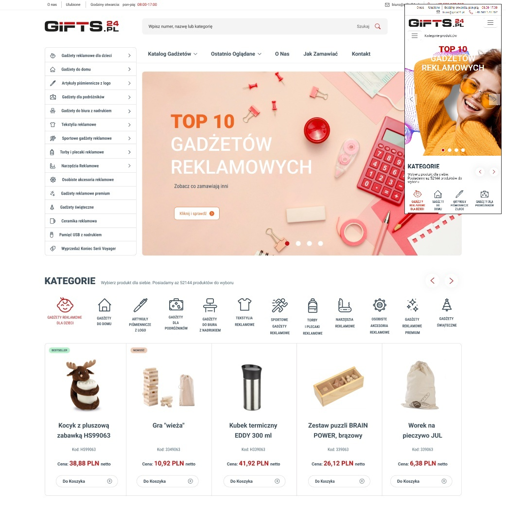

    

<h1 align="center">GIFTS24.pl website</h1>

GIFTS24.pl website ➡️ E-commerce dynamic website written using PHP, SCSS, Bootstrap, Bootbox.js, jQuery, Select2, Vanilla JavaScript, HTML5 with Swiper.js.

Website contains products page, cart page, login, register, category & account profiles/settings pages.

## Table of contents

- [Technologies](#technologies)
- [Live links](#live-links)
- [License](#license)
- [Screenshots](#screenshots)

## Technologies

Used technologies:

- JavaScript
- jQuery
- Bootbox.js
- Swiper.js 11.1.1
- Lightbox.js
- magnific-popup.js 1.1.0
- Select2
- PHP
- HTML5
- Bootstrap 5.3.2
- SCSS

## Live links

- To do

## License

License Creative Commons Non-Commercial (CC BY-NC) License 

This work is licensed under a Creative Commons Non-Commercial (CC BY-NC) License (not for commercial use)

## Screenshots

- Desktop & mobile version :desktop_computer: :iphone:

